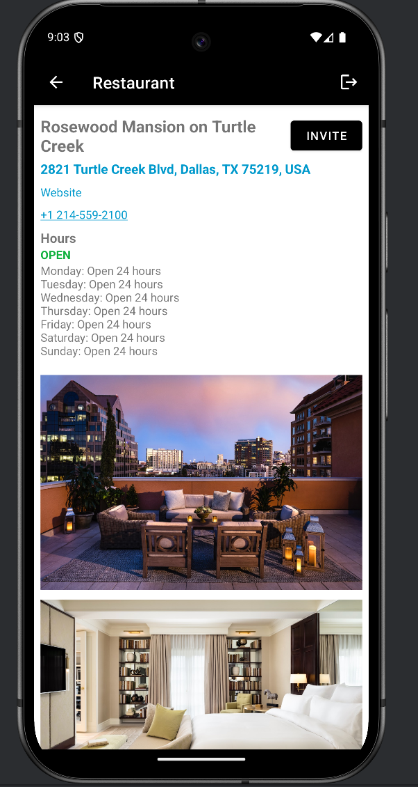
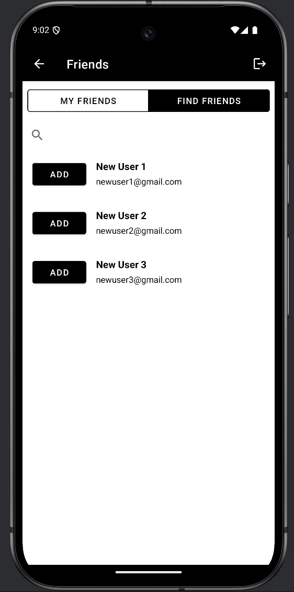
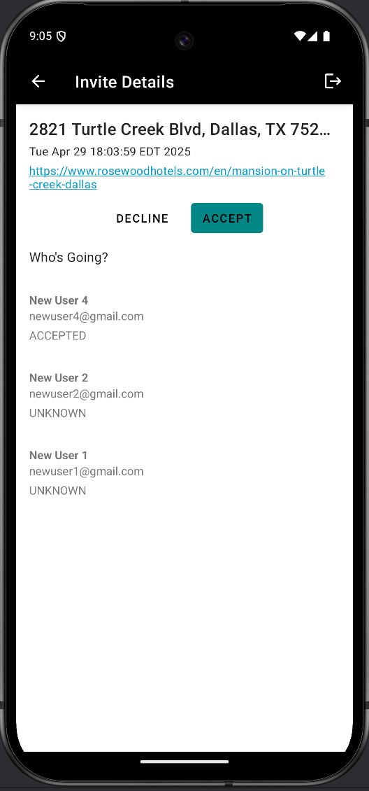
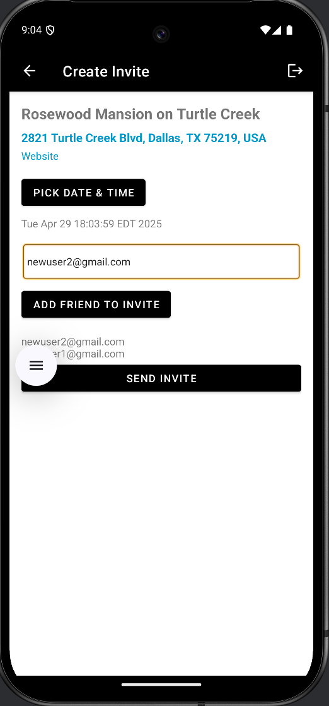
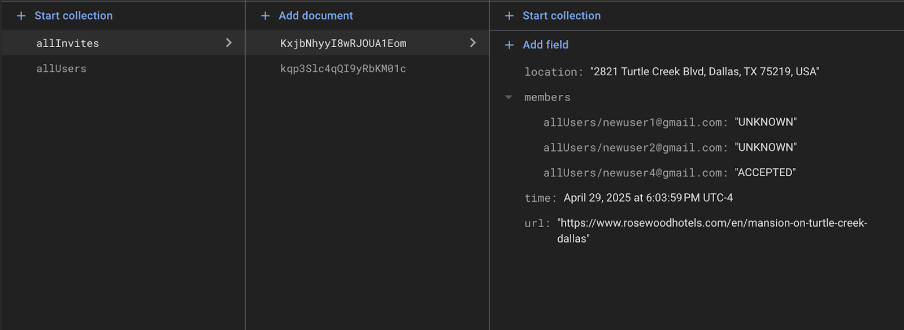
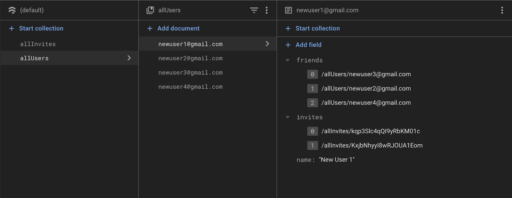

**App Title:**

* GroupMeal

**Demo Video:**

* [https://drive.google.com/file/d/1NeALmuTETWcqsDnZ7FFIBsh2l511yb-t/view](https://drive.google.com/file/d/1NeALmuTETWcqsDnZ7FFIBsh2l511yb-t/view)

**Repo Link:**

* [https://github.com/ashwinram1/groupmeal](https://github.com/ashwinram1/groupmeal)
* To run app locally: Clone this repo, then just hit the play/run button in Android Studio once the project has finished loading in

**One-Line Description:**

* A real time event planning app which lets you explore restaurants and plan dining events with your closest friends

## **Core Functionality Screenshots**

|  |  |
| :--------------------------------------------- | :--------------------------------------------- |
|  |  |

## **APIs & Platform Features**

* **Google Maps API**
  * We leverage the Google Maps and Places APIs to power our restaurant browser, delivering real-time, worldwide dining destinations that users can explore and seamlessly invite friends to join.
* **Geocoder API**
  * Used Android’s built-in Geocoder API to take any location typed in in plain English, and convert it to latitude and longitude coordinates that are then accepted by the Google Places API.
* **Firebase Firestore**
  * We use Firebase Firestore to store all user data unrelated to authentication or passwords, everything from user profiles and relationships to friend connections and event invitations.

## **Third Party Libraries/Services**

* ## **Firebase Authentication**

  * **What it does:** Manages user sign-in via email and password.
  * **Good:** Firebase Authentication delivers ready-made UI components and strong, secure token handling right out of the box. While its built-in sign-in flows can feel a bit rigid when you need a custom login experience, the trade-off is a frictionless integration and rock-solid management of authentication state, freeing us to focus on core features without wrestling with edge-case sign-in bugs.
  * **Challenging:** Keeping our Firebase Auth users and their corresponding Firestore profiles perfectly in sync proved to be one of the trickiest parts of the project.  We chose to let Firebase Auth handle all sensitive credentials  (passwords) while storing every other piece of user information—profiles, friend lists, invite histories—in Firestore.  The challenge came when the authentication state changed: on sign-in we had to eagerly fetch or create the matching Firestore document, and on sign-out we substituted in a static “INVALID” user to prevent accidental data exposure.  Unfortunately, there were edge cases where that INVALID placeholder would propagate back into Firestore writes, overwriting real user fields and corrupting state.  To fix this, we introduced explicit checks around every write operation, so that a transition to the INVALID user no longer triggers updates, and we now always rehydrate the Firestore user object immediately after any auth event.  This tighter coordination prevents race conditions and ensures that our Auth and Firestore layers remain aligned.
* **Gson**

  * **What it does:** Serialize/deserialize a Kotlin class/object to/from JSON.
  * **Good:** Very conveniently puts network response data into immediately usable Kotlin structures.
  * **Challenging:** Dealing with edge cases of network responses and declaring the types of the fields in the Kotlin data class(es) appropriately such that it can handle different types of network response data structures and data types.
* **Retrofit**

  * **What it does:** Used to make network/API calls (like GET, POST, etc.) and convert JSON responses into Kotlin/Java objects, using Gson converter.
  * **Good:** Again, abstracts away the complexities of making network request via Kotlin.
  * **Challenging:** Not challenging but only because we did assignments using Retrofit in class; if I was learning it from scratch by myself it would have been much more challenging.

## **UI/UX Highlights**

* **TimeTrackerDialog and DatePickerDialog:** When creating an invite, we replaced plain text entry of date and time with Android’s native DatePicker and TimePicker dialogs, letting users choose their event timing from a polished calendar view and clock interface. This not only streamlines the input process but also provides a clear, visually engaging cue that enhances the overall user experience.
* **Single/One Restaurant View/Fragment:** The single restaurant view neatly displays all the relevant details for a restaurant. This includes hyperlinked address, website, and phone number that all link to the relevant default phone apps to handle these. Additionally, 3 pictures are very nicely displayed for each restaurant using Glide, greatly enhancing the visual appeal.
* **Sleek Modern Design:** Some people might not be fans of the minimalist design with just black and white, but many major companies opt for similar designs on their popular apps. Setting this color scheme was not the easiest thing, as it sometimes led to some text colors matching the background colors, thus appearing invisible. However, we remedied these with both XML and Kotlin logic.

## **Backend & Logic Notes**

* **Real-Time Atomic Data Syncs:** We used Firestore batched transactions to update invites and their reverse references in a single, atomic operation. Although we were initially concerned that doing multiple document writes in one go might introduce noticeable latency, in practice these batched updates have been surprisingly fast. This approach lets us confidently modify complex, multi-document relationships, like changing an invite and updating each participant’s friend list, without risking partial failures or inconsistent state.
* **Multiple Network Requests:** A network request is made each time a new list of restaurants needs to be displayed. However the neat trick is, each time a single restaurant is clicked on, another network request needs to be made to a `details/` endpoint and passing in that place/restaurant’s specific ID, in order to retrieve more data about that place such as hours of operation, photos, a direct Google Maps link, phone number, and website to name a few. This detailed information about each restaurant is not given by the response to the network request made for the list of restaurants in a given area/location. So this was some additional unique and real-world-applicable functionality that was highly useful.

## **Key Learning / Toughest Challenge**

Our biggest takeaway is that Kotlin truly shines as a modern, expressive language; its first-class support for coroutines, extension functions, and type-safe builders makes it incredibly productive. On top of that, the ecosystem offers battle-tested libraries that shoulder much of the heavy lifting; the real trick is learning which tools best fit each problem and wiring them together cleanly.
The toughest hurdles we faced revolved around Firestore’s asynchronous APIs and local caching. Coordinating snapshot listeners, one-time fetches, and coroutine flows in a way that avoided stale data or race conditions required careful orchestration. In particular, we had to design a small wrapper around Firestore calls to suspend until a document was ready, then feed that result back into our LiveData/Flow pipelines—otherwise it was all too easy to end up with partially updated UI or redundant coroutines. Ultimately, mastering that interplay gave us a much deeper appreciation for Kotlin’s coroutine model and Firestore’s real-time strengths.

## **Firebase Data Model**

